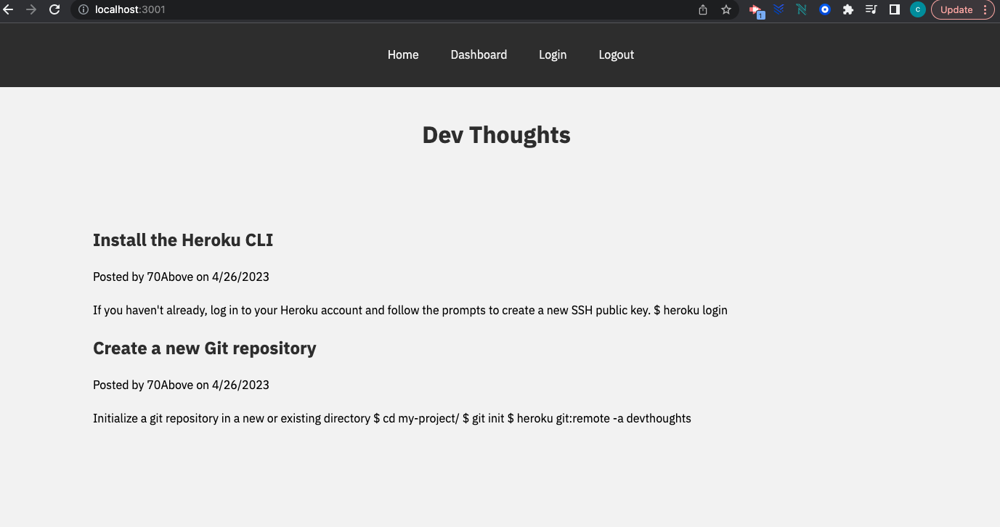

# DevThoughts

## Description

A blog site designed in the CMS format for developers to produce articles, blog posts, and express their opinions. The goal of this project is to give developers a platform to interact with each other's work and to build a community where knowledge and experiences can be exchanged.

- Motivation: To provide an environment for developers to discuss their knowledge and viewpoints on a range of technological issues.

- The goal of this project is to provide a forum for discussing articles and exchanging knowledge among developers so that they can all advance professionally.

- Solved: It takes care of the issue of the lack of a specific platform for developers to publish and talk about tech-related content.

- Learning: This project provided the chance to experiment with Handlebars.js, Sequelize ORM, the MVC architectural structure, and express-session for authentication.

## Table of Contents (Optional)

If your README is long, add a table of contents to make it easy for users to find what they need.

- [Installation](#installation)
- [Usage](#usage)
- [Credits](#credits)
- [License](#license)

## Installation

1. Clone the repository to your local machine
2. Run npm install to install all necessary dependencies
3. Create a .env file with your database credentials (DB_NAME, DB_USER, DB_PASSWORD)
4. Run the schema.sql file in your MySQL Workbench to set up the database
5. Start the application using npm start

## Usage

- Visit the deployed application on Heroku
- Browse existing blog posts on the homepage
- Sign up or log in to access dashboard and post/comment features
- Create, update, or delete your own blog posts from the dashboard
- Comment on other users' blog posts

## License

MIT License

Copyright (c) [2023] [Christian Plasencia]

Permission is hereby granted, free of charge, to any person obtaining a copy
of this software and associated documentation files (the "Software"), to deal
in the Software without restriction, including without limitation the rights
to use, copy, modify, merge, publish, distribute, sublicense, and/or sell
copies of the Software, and to permit persons to whom the Software is
furnished to do so, subject to the following conditions:

The above copyright notice and this permission notice shall be included in all
copies or substantial portions of the Software.

THE SOFTWARE IS PROVIDED "AS IS", WITHOUT WARRANTY OF ANY KIND, EXPRESS OR
IMPLIED, INCLUDING BUT NOT LIMITED TO THE WARRANTIES OF MERCHANTABILITY,
FITNESS FOR A PARTICULAR PURPOSE AND NONINFRINGEMENT. IN NO EVENT SHALL THE
AUTHORS OR COPYRIGHT HOLDERS BE LIABLE FOR ANY CLAIM, DAMAGES OR OTHER
LIABILITY, WHETHER IN AN ACTION OF CONTRACT, TORT OR OTHERWISE, ARISING FROM,
OUT OF OR IN CONNECTION WITH THE SOFTWARE OR THE USE OR OTHER DEALINGS IN THE
SOFTWARE.

